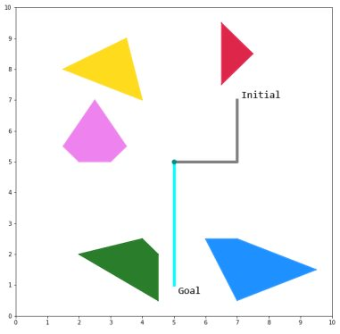
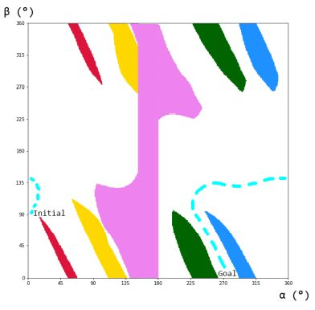
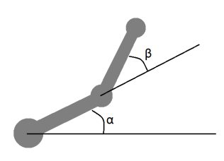

# 2-link-arm-c-space

#### 2-link Arm Configuration Space generator for Rutgers University Intro to Computational Robotics CS 560 Fall 2021
 
Environment: initial and goal states for two-link arm robot with obstacles
  

  

  
Result: computed valid (white) configuration space of two link arm with a possible solution path (drawn in cyan)
  

  

  
Angles alpha and beta are defined as:
  

  

  

Note: intersect.py from Ansh Riyal's (https://github.com/ANSH-RIYAL) public contributions on line-intersection
